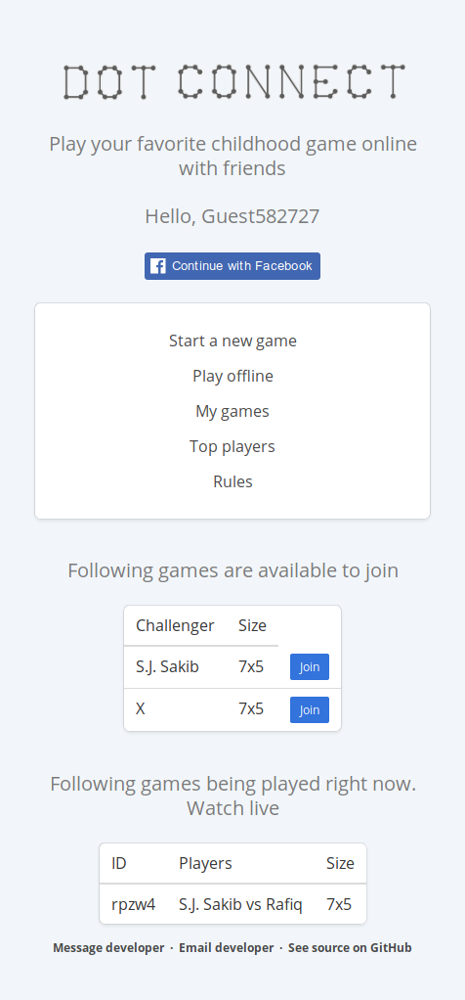
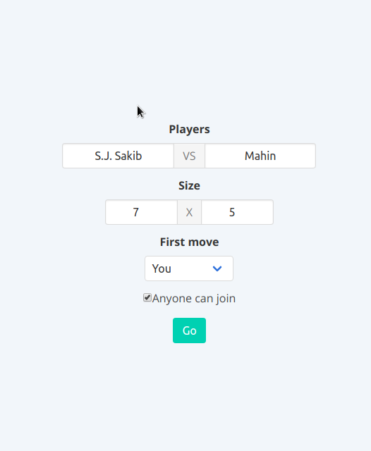
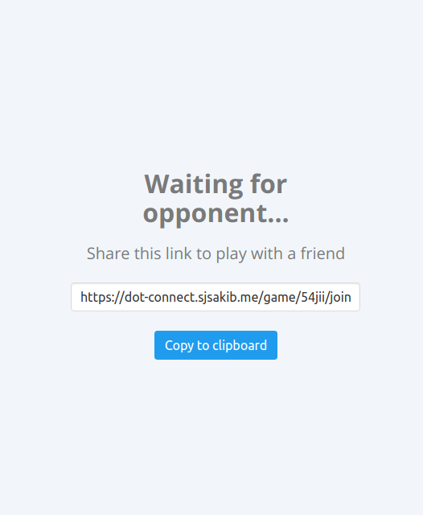
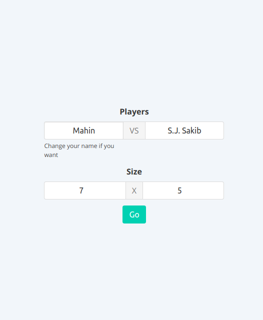
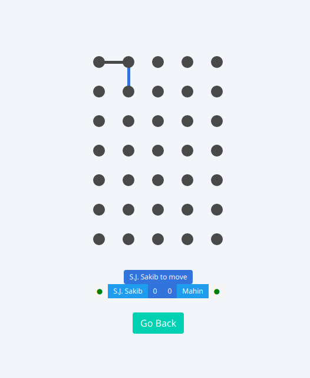

# Dot-Connect Game

A turn based two player game built on MERN stack technologies.

Available to play [here.](https://dot-connect.sakib.dev/)

Read the development story [here.](https://medium.com/@sjsakib/how-i-built-my-first-react-app-dot-connect-364f39ca0db7)

## Run this on your own machine

You will need to have node, npm and yarn installed.

```
# First clone this repository with git
git clone https://github.com/sjsakib/dot-connect.git

# Then move inside the project, install the client side dependencies and run the front-end
cd dot-connect
yarn install
yarn start

# Now open a new shell window and move to the server folder
# and install the server side dependencies and run the server
cd server
yarn install
yarn start
```

An internet connection is required for the app to work. Because it uses a sandbox database instance from [mlab](https://mlab.com/) instead of local installation of Mongo. 


## Rules of the game
The game starts with a grid of dots. Each player in turn connects two dots vertically or horizontally. If this connection makes a box, he gets a point and another move. No move can be passed. When the grid is complete, the player with most points wins.


## Technologies used
Key technologies used are [react](https://github.com/facebook/react), [react-redux](https://github.com/reduxjs/react-redux), [react-router](https://github.com/ReactTraining/react-router), [socket.io-client](https://github.com/socketio/socket.io-client) in the frontend and Node, [Express](https://github.com/expressjs/express), Mongo, [Mongoose](https://github.com/Automattic/mongoose), [socket.io](https://github.com/socketio/socket.io) in the backend.


## Feature

The main feature is to be able play the game online against a friend. Link of the game can be sent after creating a new game. Anyone with that link can join the game. If the `Anyone can join` option is checked while creating the game, anyone can join the from the available game list.

The on-going games can be watched live.

Users can sign-in using facebook to save their game progresses, and score. Top players are shown in a list under `Top player`.

Here are few screenshots of the game.



The home page



Create a game



Waiting for opponent



Join a game



A game going on


Top chart
